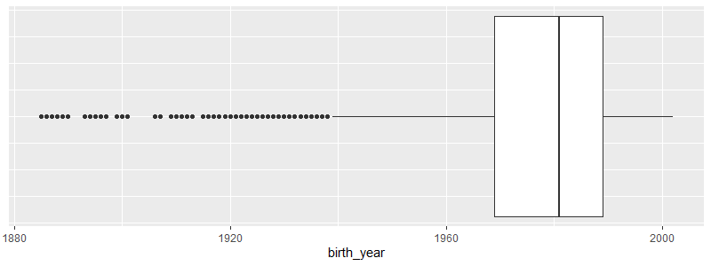

# Intro

[Citi Bike](https://citibikenyc.com/homepage) is the largest bike sharing program
in the United States with 25000 bikes and more than 1500 stations
across New York City.
It was founded in 2013 and trip data on monthly basis are freely available on
their [aws-server](https://s3.amazonaws.com/tripdata/index.html) as zipped
csv files.

In this project, an analysis of the Citi Bike trip data for the year 2018 is
presented.
The project is structured into the following steps:

  - get the data from the server and prepare them for further analysis
  - analyze the data and make visualizations to highlight the findings
  - build and tune some classification models to identify user types, i.e.
  day pass users (customers) or annual members (subscribers)

# Dataset

Using the code provided in `01_citibike_data.R`, the Citi Bike data set for the
year 2018 is downloaded, cleaned and prepared for the analysis.

## Getting the raw data

First the monthly data are loaded directly from the server into a data table.
Since the monthly files are large (up to 80 MB each), this can take a few
minutes but saves much time and manual work.

The raw `citibike_data` for 2018 consists of 17548339 rows and 15 columns.
Each row is a record of one bike trip and the columns contain trip information on

  - trip duration in seconds with start and end time of the trip
  - name, ID, latitude and longitude of start and end station
  - bike ID
  - user type (daily customer or annual subscriber)
  - gender and year of birth of the user

## Data cleaning

Using `str(citibike_data)` it is obvious that some adjustments are needed to
conveniently work with the data set.
White spaces in column names are replaced with underscores and all of
the variables `start_station_id`, `start_station_name`,
`end_station_id`, `end_station_name`, `bikeid`, `usertype` and `gender`
are converted to factors, since this is the more suitable data type.
Further, the `tripduration` is transformed into minutes.

Before starting the analysis, the data needs to be cleaned by dealing
with missing values and outliers such as anomalous behavior or false
information.
To get a first impression, check `summary(citibike_data)`.
The summary directly indicates for some problems to deal with:

  - missing values in `start_station_id` and `end_station_id`
  - some massive outliers in `tripduration`
  - outliers in `start_station_latitude` and `end_station_latitude`
  - implausible values in `birth_year`

### Missing values

Missing values are identified by checking for `NA` values or `"NULL"` factors.
There are missing values for the variables `start_station_id`,
`start_station_name`, `end_station_id` and `end_station_name` and it
turns out that all trips with missing values have missing values for all
four variables.
Overall, there are 2497 trips with missing values.
It would be possible to gather more information on the missing values by the
latitude and longitude variables of the respective stations and try to imput the
missing values.
But since information on both, start and end station, for each trip are missing
it seems more like systematically missing values than a random error.
It is worth to mention that the missing values occurred for the first time at
`2018-08-15 11:31:37`.
It might be that some stations were closed or moved over the year such that the
station information went missing in the data set.
However, since the trips with missing values are systematical errors and
represent only a negligible fraction of the full data set, these
trips are excluded from the analysis.

### Anomalous trip duration

The trip duration ranges from 1.016 minutes to 325167.5 minutes, which is
about 225 days.

For short trips, note that trips that were below one minute in length
has been removed from the beginning (potentially false starts or users
trying to re-dock a bike to ensure it is secure, as stated at this [Citi
Bike page](https://ride.citibikenyc.com/system-data)).
But the data can be tweaked a little more by checking if `start_station_id ==
end_station_id`.
If this is the case and the trip was very short, say less than two minutes, 
there might have been something wrong with the bike.
The user migt have returned it to the same station and might have taken an
other bike.
Therefore, trips were these both conditions hold true are removed.

More serious outliers are the very long trips that have to be dealed with.
The 99%-quantile is at 58 minutes and it can be assumed, that there are
only very few real trips that take longer.
First, there is no reasonable trip that would take that long and second, it
would become more and more expensive.
Note that for customers only 30 minutes are free and 45 minutes for
subscribers.
Each additional minute is charged with a fee according to [Citi Bike pricing](
https://ride.citibikenyc.com/pricing).
Hence, for trips longer than one hour (attempted) theft or incorrect docking
can be assumed.
These trips are also removed from the analysis,

### Location of the stations

The geographic coordinates of NYC are somewhere around 40 degrees latitude
and 74 degrees longitude.
Some stations in the data set were located at around 45 degrees latitude,
which is approximately 500 km away from NYC.
These are the stations 622, 770, 647, 798 that are located in Canada.
Maybe there have been some test drives and these trips were added to the data
set by mistake.
Since these stations are not located in NYC, these trips are removed from the
data set.

### Users year of birth

There are obviously some false statements about the year of birth.
The smallest year of birth is 1885 which means that the user would have been
at least 133 years old.
There are even more outliers as shown in the boxplot.

Without any offense there might be no user older than 70 year,
i.e. born before 1948.
Since this is a very small amount of the total data, these trips are simply 
removed.
Note that the limit of age 70 was set arbitrary and other limits are possible,
such as the lower whisker of the boxplot, that is 1938, or some
distance of standard deviation to the mean.

On the other side, the youngest user was born in 2002 which is a
realistic value.
It can be assumed that users have to be at least 16 years to rent a bike.

### Finalize the data

After the cleaning process there are still 17227208 trips left to analyze.
For a more convenient analysis and more descriptive visualizations we add
the additional information `date`, `month`, `dayofweek`, and `hour`,
all with respect to the start time, to the data set.
