# Intro

[Citi Bike](https://citibikenyc.com/homepage) is the largest bike sharing program
in the United States with 25000 bikes and more than 1500 stations
across New York City.
It was founded in 2013 and trip data on monthly basis are freely available on
their [aws-server](https://s3.amazonaws.com/tripdata/index.html) as zipped
csv files.

In this project, an analysis of the Citi Bike trip data for the year 2018 is
presented.
The project is structured into the following steps:

  - get the data from the server and prepare them for further analysis
  - analyze the data and make visualizations to highlight the findings
  - build and tune some classification models to identify user types, i.e.
  day pass users (customers) or annual members (subscribers)

# Dataset

Using the code provided in `01_citibike_data.R`, the Citi Bike data set for the
year 2018 is downloaded, cleaned and prepared for the analysis.

## Getting the raw data

First the monthly data are loaded directly from the server into a data table.
Since the monthly files are large (up to 80 MB each), this can take a few
minutes but saves much time and manual work.

The raw `citibike_data` for 2018 consists of 17548339 rows and 15 columns.
Each row is a record of one bike trip and the columns contain trip information on

  - trip duration in seconds with start and end time of the trip
  - name, ID, latitude and longitude of start and end station
  - bike ID
  - user type (daily customer or annual subscriber)
  - gender and year of birth of the user

## Data cleaning

Using `str(citibike_data)` it is obvious that some adjustments are needed to
conveniently work with the data set.
White spaces in column names are replaced with underscores and all of
the variables `start_station_id`, `start_station_name`,
`end_station_id`, `end_station_name`, `bikeid`, `usertype` and `gender`
are converted to factors, since this is the more suitable data type.
Further, the `tripduration` is transformed into minutes.

Before starting the analysis, the data needs to be cleaned by dealing
with missing values and outliers such as anomalous behavior or false
information.
To get a first impression, check `summary(citibike_data)`.
The summary directly indicates for some problems to deal with:

  - missing values in `start_station_id` and `end_station_id`
  - some massive outliers in `tripduration`
  - outliers in `start_station_latitude` and `end_station_latitude`
  - implausible values in `birth_year`

### Missing values

Missing values are identified by checking for `NA` values or `"NULL"` factors.
There are missing values for the variables `start_station_id`,
`start_station_name`, `end_station_id` and `end_station_name` and it
turns out that all trips with missing values have missing values for all
four variables.
Overall, there are 2497 trips with missing values.
It would be possible to gather more information on the missing values by the
latitude and longitude variables of the respective stations and try to imput the
missing values.
But since information on both, start and end station, for each trip are missing
it seems more like systematically missing values than a random error.
It is worth to mention that the missing values occurred for the first time at
`2018-08-15 11:31:37`.
It might be that some stations were closed or moved over the year such that the
station information went missing in the data set.
However, since the trips with missing values are systematical errors and
represent only a negligible fraction of the full data set, these
trips are excluded from the analysis.

### Anomalous trip duration

The trip duration ranges from 1.016 minutes to 325167.5 minutes, which is
about 225 days.

For short trips, note that trips that were below one minute in length
has been removed from the beginning (potentially false starts or users
trying to re-dock a bike to ensure it is secure, as stated at this [Citi
Bike page](https://ride.citibikenyc.com/system-data)).
But the data can be tweaked a little more by checking if `start_station_id ==
end_station_id`.
If this is the case and the trip was very short, say less than two minutes, 
there might have been something wrong with the bike.
The user migt have returned it to the same station and might have taken an
other bike.
Therefore, trips were these both conditions hold true are removed.

More serious outliers are the very long trips that have to be dealed with.
The 99%-quantile is at 58 minutes and it can be assumed, that there are
only very few real trips that take longer.
First, there is no reasonable trip that would take that long and second, it
would become more and more expensive.
Note that for customers only 30 minutes are free and 45 minutes for
subscribers.
Each additional minute is charged with a fee according to [Citi Bike pricing](
https://ride.citibikenyc.com/pricing).
Hence, for trips longer than one hour (attempted) theft or incorrect docking
can be assumed.
These trips are also removed from the analysis,

### Location of the stations

The geographic coordinates of NYC are somewhere around 40 degrees latitude
and 74 degrees longitude.
Some stations in the data set were located at around 45 degrees latitude,
which is approximately 500 km away from NYC.
These are the stations 622, 770, 647, 798 that are located in Canada.
Maybe there have been some test drives and these trips were added to the data
set by mistake.
Since these stations are not located in NYC, these trips are removed from the
data set.

### Users year of birth

There are obviously some false statements about the year of birth.
The smallest year of birth is 1885 which means that the user would have been
at least 133 years old.
There are even more outliers as shown in the boxplot.

  

Without any offense there might be no user older than 70 year,
i.e. born before 1948.
Since this is a very small amount of the total data, these trips are simply 
removed.
Note that the limit of age 70 was set arbitrary and other limits are possible,
such as the lower whisker of the boxplot, that is 1938, or some
distance of standard deviation to the mean.

On the other side, the youngest user was born in 2002 which is a
realistic value.
It can be assumed that users have to be at least 16 years to rent a bike.

### Finalize the data

After the cleaning process there are still 17227208 trips left to analyze.
For a more convenient analysis and more descriptive visualizations we add
the additional information `date`, `month`, `dayofweek`, and `hour`,
all with respect to the start time, to the data set.

# Analysis

After the cleaning process, the data is ready to get analyzied.
The underlying code is provided in `02_citibike_analysis.R` and
`/src/viz_functions.R`.

## Citi Bike user

The first thing to notice is the proportion of trips taken by customers and
subscribers.
There is an overbalance of subscriber trips of approximately 90% to 10% customer
trips.

  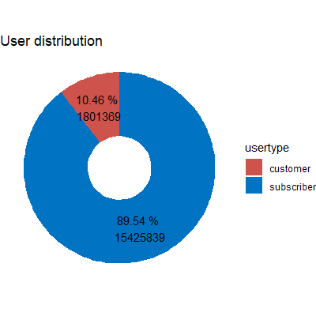

Subscribers are users with an annual membership whereas customers are users
with a day pass.
Subscribers are obviously habitatnts of NYC that use rental bike on a regular
basis, for example for going to work.
Customers are assumed to be tourists or habitants that use rental bikes only
rarely.
This clearly explains the overrepresentation of subscribers in the data set.
It is reasonable to assume that the behaviour of subscribers and customers is
totally different, wherefore the analysis considers the groups separately.

  
  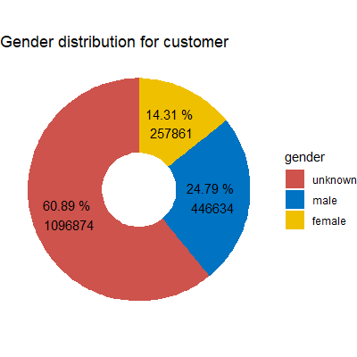

The gender distribution for each group looks totally different.
For subscribers, three quarter of the users are male and one quarter are female
users.
There is also a small amount of 2% of subscribers that did not reveal their
gender (or do not identify as one).
For customers, the majority of 60% is of unkonwn gender.
For the rest, as for the subscribers, there are more male than female user.
Not revealing the gender could be to stay more anonymous or out of laziness by
filling out a form.
For both cases it is reasonable to assume that it concerns the customers much more.
Becoming an annual member requires much more information than gender, such as
address or billing account data, such that there is only limited reason for
subscribers to hide their gender.

The distribution of year of birth looks unsuspicious except for the massiv
overrepresentation of `birth_year == 1969`.

  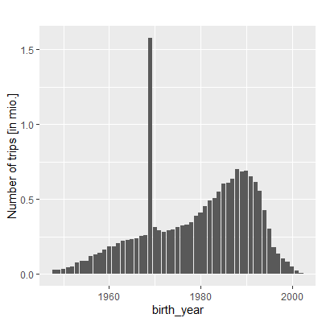

Zooming into the user types reveals that that the count of users born in 1969
is increased for the subscribers but is mainly driven by the customers.
By also taking the gender into account it is very suspcious that the combination
of `birth_year == 1969` and `gender == "unkown"` is heavily overrepresented.

  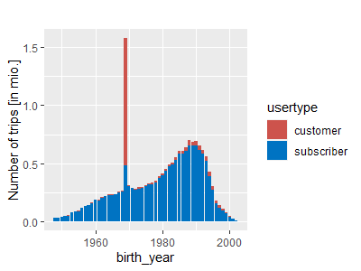
  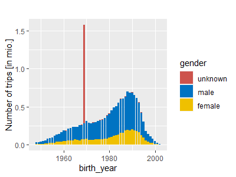

Or to put it the other way, nearly all users that hide their gender also state
that they where born in 1969.
Finally, the restriction to the year 1969 shows that the `birth_year == 1969`
and `gender == "unkown"` combination is definitely the main choice for customers
but also the overrepresentation of the subscribers born in 1969 shows this
specific combination.

  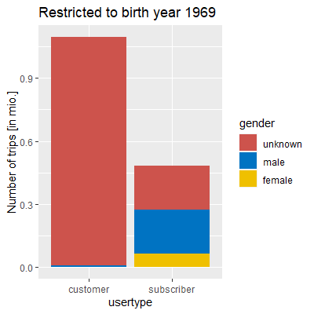

A possible explanation is that `birth_year == 1969` and `gender == "unkown"`
could be the default value in an online form.
A subscriber, that has to fill in further information is also willing to change
the default values.
A customer by contrast has no reason to change these values at all.

## Trip information

The next question to answer is when trips are taken.

  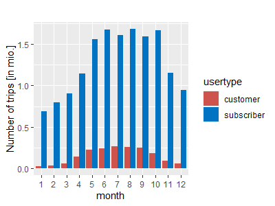
  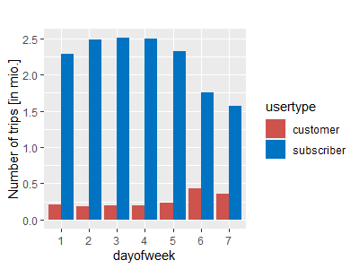
  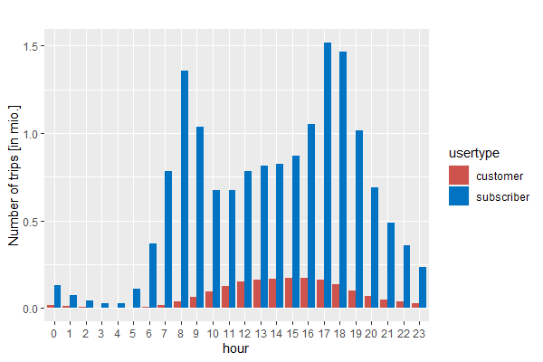

There is no supsrise that there are much more trips taken in warmer month.
This holds true for both user groups.
Subscribers prefer to take trips during the week whereas customers take more
trips at weekends.
This backs up the assumption that subscribers use the bike for going to work and
customers for rather touristic activities.
This becomes even more clear from the trips taken per hour.
In both user groups there are more trips taken throughout the day than at night.
The distribution for the customers looks like a normal distribution but for the
subscribers there are significant peaks araound 8 a.m and 6 p.m. which is during
rush hour.
Splitting the picture further into day of week and hour yields the following
heatmaps.

  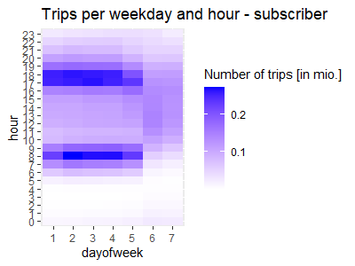
  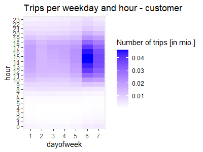

It becomes obvious that the main usage time from subscribers is during rush hour
on weekdays and for subscribers it is during the day at weekends.

## Trip duration

Taking a look into how trips take, there is again a totally different picture
for both groups.

  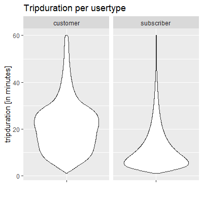
  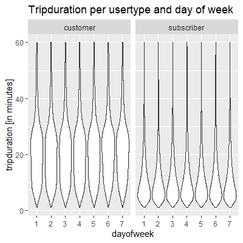
   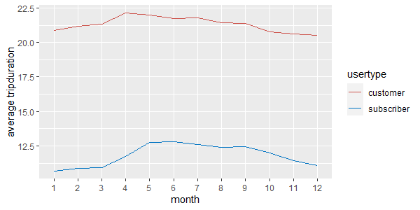

Subscriber trips are rather short even though they have a free use for 45 minutes.
But since they are annual members, there is no need to optimize the usage time.
They use the rental bikes pragmatically, e.g. for going to work.
Customers trips on the other hand usually take much longer.
They are not in a hurry and take trips for fun and even try to max out their
usage time.
The behaviour for both groups does not change for different days of the week.
And even for different month the (average) usage time stays nearly the same.

## Most popular stations

  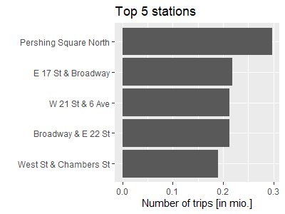

  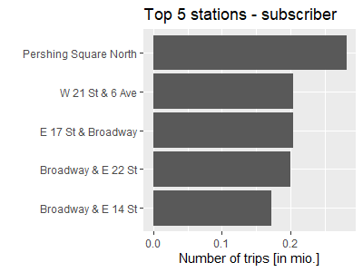
  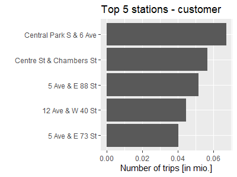

The most popular station by far is, which is a public square in Manhattan.
For the both user groups, however, the popularity of stations differ.
It is not suprising, that subscribers use stations close to squares and office
buildings whereas customers favor stations close to parks or shopping centers.

## Most popular trips

  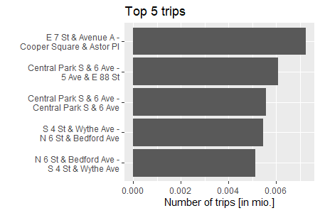

  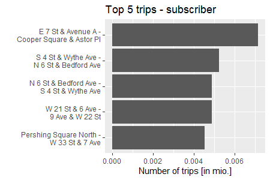
  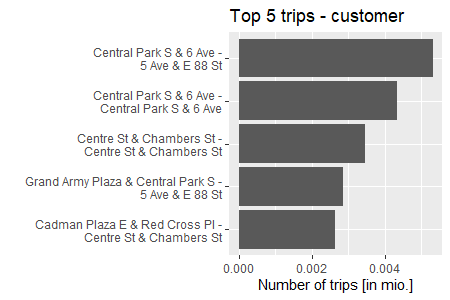

Benath popular stations, there are also popular trips.
Again, these differ for both user groups.
An interessting point is, that some of the most popular customer trips are
circular trips.
They are maybe used for sightseeing or for simply making a tour.
