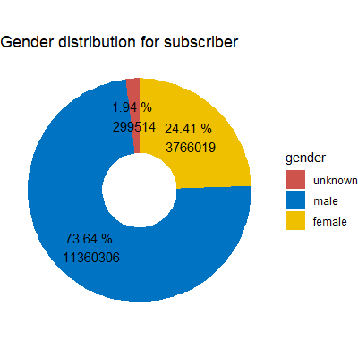

# Intro

[Citi Bike](https://citibikenyc.com/homepage) is the largest bike sharing program
in the United States with 25000 bikes and more than 1500 stations
across New York City.
It was founded in 2013 and trip data on monthly basis are freely available on
their [aws-server](https://s3.amazonaws.com/tripdata/index.html) as zipped
csv files.

In this project, an analysis of the Citi Bike trip data for the year 2018 is
presented.
I structure the project into the following steps:

  - get the data from the server and prepare them for further analysis
  - analyze the data and make visualizations to highlight the findings
  - build and tune some classification models to identify user types, i.e.
  day pass users (customers) or annual members (subscribers)

# Data set

Using the code provided in `01_citibike_data.R`, the Citi Bike data set for the
year 2018 can be downloaded, cleaned and prepared for the analysis.

## Getting the raw data

First the monthly data are loaded directly from the server into a data table.
Since the monthly files are large (up to 80 MB each), this can take a few
minutes but saves much time and manual work.

The raw `citibike_data` for 2018 consists of 17548339 rows and 15 columns.
Each row is a record of one bike trip and the columns contain trip information on

  - trip duration in seconds with start and end time of the trip
  - name, ID, latitude and longitude of start and end station
  - bike ID
  - user type (daily customer or annual subscriber)
  - gender and year of birth of the user

## Data cleaning

Using `str(citibike_data)` it is obvious that some adjustments are needed to
conveniently work with the data set.
I replace white spaces in column names with underscores and convert all of
the variables `start_station_id`, `start_station_name`, `end_station_id`,
`end_station_name`, `bikeid`, `usertype` and `gender` to factors, since this is
the more suitable data type.
Further, I transform the `tripduration` into minutes.

Before starting the analysis, the data needs to be cleaned by dealing with
missing values and outliers, such as anomalous behavior or false information.
To get a first impression, I check `summary(citibike_data)`.
The summary directly indicates for some problems to deal with:

  - missing values in `start_station_id` and `end_station_id`
  - some massive outliers in `tripduration`
  - outliers in `start_station_latitude` and `end_station_latitude`
  - implausible values in `birth_year`

### Missing values

I identify missing values by checking for `NA` values or `"NULL"` factors.
There are missing values for the variables `start_station_id`,
`start_station_name`, `end_station_id` and `end_station_name` and it turns out
that all trips with missing values have missing values for each of the four
variables.
Overall, there are 2497 trips with missing values.
It would be possible to gather more information on the missing values by the
latitude and longitude variables of the respective stations and try to impute
the missing values.
But since information on both, start and end station, for each trip are missing
it seems more like systematical problem than as a random error.
It is worth to mention that the missing values occur for the first time at
`2018-08-15 11:31:37`.
It might be that some stations were closed or moved over the year, such that the
station information went missing in the data set.
However, since the trips with missing values are systematical errors and
represent only a negligible fraction of the full data set, I exclude them from
the analysis.

### Anomalous trip duration

The trip duration ranges from 1.016 minutes to 325167.5 minutes, which is
about 225 days.

First, I investigate the short trips.
Note that, according to the [Citi Bike page](https://ride.citibikenyc.com/system-data),
trips that were below one minute in length have already been removed
(potentially false starts or users trying to re-dock a bike to ensure it is
secure).
I tweak the data a little more by checking if `start_station_id == end_station_id`.
If this is the case and if the trip was very short, say less than two minutes, 
there might have been something wrong with the bike.
The user might have returned it to the same station and might have taken an
other bike.
Therefore, I removed trips were these both conditions hold true.

More serious outliers are the very long trips that I have to deal with.
The 99%-quantile is at 58 minutes and I assume, that there are only very few
real trips that take longer.
First, there is no reasonable trip that would take that long and second, it
would become more and more expensive.
According to the [Citi Bike pricing information](https://ride.citibikenyc.com/pricing)
after 30 minutes a customer has to pay a fee for each additional minute.
For subscribers, the line is at 45 minutes.
Therefore, if a trips take longer than an hour, I assume (attempted) theft or
incorrect docking and remove those trips from the analysis.


### Location of the stations

The geographic coordinates of NYC are somewhere around 40 degrees latitude
and 74 degrees longitude.
Some stations in the data set were located at around 45 degrees latitude,
which is approximately 500 km away from NYC.
These are the stations 622, 770, 647, 798 that are located somewhere in Canada.
I assume that there have been some test drives and that these trips were added
to the data set by mistake.
Since these stations are not located in NYC, I remove them from the data set.

### Users year of birth

There are obviously some false statements about the year of birth.
The smallest year of birth is 1885 which means that the user would have been
at least 133 years old.
There are even more outliers as shown in the boxplot.
<p align="center">
  
</p>

Without any offense I assume that there is no user older than 70 year,
i.e. born before 1948.
Since this is a very small amount of the total data, I remove those trips.
It is worth to think about if these obviously false information can be used for
the classification model, but I can not be sure for the other year of birth
information if they are true or not.
Note that I set the limit of age 70 arbitrarily and other limits, such as the
lower whisker of the boxplot (1938) or some distance of standard deviation to
the mean, are possible.

On the other side, the youngest user was born in 2002 which is a
realistic value.
I assume that users have to be at least 16 years old to rent a bike.

### Finalize the data

After the cleaning process there are still 17227208 trips left to analyze.
For a more convenient analysis and more descriptive visualizations I add
the additional information `date`, `month`, `dayofweek`, and `hour`,
all with respect to the start time.

# Analysis

After the cleaning process, the data is ready for the analysis.
The underlying code is provided in `02_citibike_analysis.R` and
`/src/viz_functions.R`.

## Citi Bike user

The first thing to notice is the proportion of trips taken by customers and
subscribers.
There is an overbalance of subscriber trips of approximately 90% to 10% customer
trips.
<p align="center">
  
</p>

Subscribers are users with an annual membership whereas customers are users
with a day pass.
Subscribers are obviously citizens of NYC that use rental bikes on a regular
basis, for example for going to work.
Customers are tourists or citizens that use rental bikes only rarely.
This clearly explains the over representation of subscribers in the data set.
It is reasonable to assume that the behavior of subscribers and customers is
totally different, wherefore I consider the groups separately.
<p align="center">
  
  
</p>

The gender distribution for each group is very different.
For subscribers, three quarter of the users are male and one quarter are female
users.
There is also a small amount of 2% of subscribers that did not reveal their
gender (or do not identify as one of those).
For customers, the majority of 60% is of unknown gender.
For the rest, as for the subscribers, there are more male than female user.
Not revealing the gender could be to stay more anonymous or out of laziness
while filling out a form.
It is reasonable to assume that this mainly concerns the customers.
Becoming an annual member requires much more information than gender, such as
address or billing account, such that there is only limited reason for
subscribers to not give out the gender information.

The distribution of year of birth is unsuspicious except for the massive
over representation of `birth_year == 1969`.
<p align="center">
  
</p>

Zooming into the user types reveals that the count of users born in 1969
is increased for subscribers but is mainly driven by customers.
By also taking the gender into account, it is very suspicious that the combination
of `birth_year == 1969` and `gender == "unknown"` is heavily over represented.
<p align="center">
  
  
</p>

Or to put it the other way, nearly all users that hide their gender also state
that they where born in 1969.
Finally, the restriction to the year 1969 shows that the `birth_year == 1969`
and `gender == "unkown"` combination is definitely the main choice for customers
but also the over representation of subscribers born in 1969 shows this
specific combination.
<p align="center">
  
</p>

A possible explanation is that `birth_year == 1969` and `gender == "unknown"`
could be the default value in an online form.
A subscriber, that has to fill in further information is also willing to change
the default values.
A customer by contrast has no reason to change these values at all.

## Trip information

The next question to answer is when trips are taken.
<p align="center">
  
  
  
</p>

There is no surprise that there are much more trips taken in warmer month.
This holds true for both user groups.
Subscribers prefer to take trips during the week whereas customers take more
trips at weekends.
This backs up the assumption that subscribers use the bike for going to work and
customers for rather touristic activities.
This becomes even more clear from the trips taken per hour.
In both user groups there are more trips taken throughout the day than at night.
The distribution for the customers looks like a normal distribution but for the
subscribers there are significant peaks around 8 am and 6 pm, which is during
rush hour.
Splitting the picture further into day of week and hour yields the following
heatmaps.
<p align="center">
  
  
</p>

It becomes obvious that the main usage time from subscribers is during rush hour
on weekdays and for subscribers it is during the day at weekends.

## Trip duration

Taking a look into how long trips take, there is again a different picture
for both groups.
<p align="center">
  
  
  
</p>

Subscriber trips are rather short even though they have a free use for 45 minutes.
But since they are annual members, there is no need to optimize the usage time.
They use the rental bikes pragmatically, e.g. for going to work.
Customers trips, on the other hand, usually take much longer.
They are not in a hurry and take trips for fun and even try to max out their
usage time.
The behavior for both groups does not change for different days of the week.
And even for different month the (average) usage time stays nearly the same.

## Most popular stations

<p align="center">
  
</p>
<p align="center">
  
  
</p>

The most popular station by far is `Pershing Square North`, which is a public
square in Manhattan.
For both user groups, however, the popularity of stations differs.
It would be nice to have further information about the surroundings of each station.
I would assume that subscribers use stations close to squares and office
buildings whereas customers favor stations close to parks, shopping centers,
or sights.

## Most popular routes

<p align="center">
  
</p>
<p align="center">
  
  
</p>

Beneath popular stations, there are also popular trips.
Again, these differ for both user groups.
An interesting point is, that some of the most popular customer trips are
circular trips.
They are maybe used for sightseeing or for simply making a bike tour.
It would also be interessting to see how the popularity of tours varies around
the day.
It would for example assume that subscribers move from the outer boroughs into
the office regions in the morning and the other way round in the afternoon.

# Classification of user type

In the last part of the project the goal is to build a classification model that
classifies the two user groups `subscriber` and `customer`.
To not go beyond the scope, I only use the data from the presented analysis and
no other data sources.
This is not an easy task, since there are many similar trips for the user groups.
For example, I assume that a user takes some test trips as a customer before
becoming a subscriber.
So this user takes nearly the same trips, one time as a customer and one time as
a subscriber.
Thus, no perfect results can be expected.
The utilized code is provided in `03_citibike_classification.R` and
`/src/classification_functions.R`.

## Preparation

Since the data set is very large, I draw a 5% random sample from the data to
reduce computational costs.
This subsample is still representative for the whole population.
It consists of 861360 trips and preserves the unbalanced user types.

As seen in the analysis, there are some feature combinations that might have
huge potential to identify a specific user type.
Therefore, and to reduce computational costs, I built some new features:

  - `gender_bin`: indicates if `gender` is known or not
  - `user_anonym`: users with unknown gender born in 1969
  - `weekend`: indicates if the trips was taken at weekend or not
  - `rushhour`: indicates if the trips was taken during rush hour
  - `circle_trip`: states if start station and end station are equal or not
  - `season`: gives the season when the trip was taken
  (`winter`, `spring`, `summer`, or `fall`)
  - `time_of_day`: gives the time of the day when the trip was taken
  (`morning`, `afternoon`, `evening`, or `night`)

Finally, I split the into a training (60%), a validation (20%), and a test
set (20%) at random.
Note that this still preserves the unbalanced user types.

Since the classes are unbalanced, i.e. 90% subscribers to 10% customers, the
benchmark for the model is at least to exceed an accuracy of 90%.
Further common measures that I use are precision, recall and F1-score, as well
as the AUC
Since there is no specific task, I reach for a balanced overall performance, i.e.
a high F1-score.
The evaluation of the models on the validation set are summarized in the table at
the end of the section.

## Logistic regression models

I usually start with a rather simple model and work my way up.
This helps to identify which features have large predicting power and prevents
from overfitting.

As seen in the analysis, frequently customers are anonymous users that take
rather long trips.
Thus, the first model (`glm1`) uses the features `user_anonym + tripduration`.
The results in terms of accuracy, F1-score and AUC are actually quiet good but
there are possible improvements in terms of recall.
The `summary(glm1)` shows that `user_anonym` is the feature with large
predicting power.
The `tripduration` only has influence if trips take longer than 62 minutes, but
these are removed from the data set (time cap at 60 minutes).

Since the data set is very large and the model is simple, it is an underfitting
problem and more and more complex features can be used.
For the next model (`glm2`) I therefore use a polynomial of `tripduration` as
well as interactions `user_anonym`, i.e. `(user_anonym + poly(tripduration, 2))^2`.
This slightly improves the model in terms of accuracy and precision, but
deteriorates especially for recall.

Thus, `tripduration` does not have predicting power.
For the next model (`glm3`) I use the features `user_anonym + rushhour`, since
rushhour trips are mainly taken by subscribers.
Suprisingly, the results are quiet similiar to `glm1` but with a much worse AUC.
Checking the `summary(glm3)` reveals that `rushhour` does not have an impact.

Since circle trips and trips on weekends are more typical for customers, I try
`user_anonym + circle_trip + weekend` for the next model (`glm4`).
Except for AUC, the results are again pretty similar to `glm1`.
I therefore add station information to the model (`glm5`) in terms of polynomial
interactions of start station information and end station information, i.e.
```
user_anonym + circle_trip + weekend +
(poly(start_station_latitude, 2) + poly(start_station_longitude, 2))^2 +
(poly(end_station_latitude, 2) + poly(end_station_longitude, 2))^2
```
But still, except for AUC, this is similar to `glm1`.

Finally, just to check, the last model (`glm6`) takes all features into account,
i.e.
```
user_anonym + tripduration + rushhour + circle_trip + weekend + season + time_of_day +
(poly(start_station_latitude, 2) + poly(start_station_longitude, 2))^2 +
(poly(end_station_latitude, 2) + poly(end_station_longitude, 2))^2
```
And again, the results are similar to `glm1`.
Obviously, for a logistic regression model, the only feature that has an impact
is `user_anonym`.

## Random forest model

Out of curiosity, I try if its possible to overfit.
Therefore I use a random forest model with all features, i.e.
```
usertype ~  user_anonym + tripduration + rushhour + circle_trip +
weekend + season + time_of_day +
start_station_latitude + start_station_longitude +
end_station_latitude + end_station_longitude
```
Finally, this model performs a bit better than `glm1` but the recall is still low.
I could invest some more time in tuning this model but since it is not
strikingly increased I let it be good at this point.

## Results and Outlook

The following table shows the results of all presented models.

|           | glm1  | glm2  | glm3  | glm4  | glm5  | glm6  | rf1   |
|-----------|-------|-------|-------|-------|-------|-------|-------|
| accuracy  | 94.65 | 94.71 | 94.65 | 94.65 | 94.65 | 94.70 | 95.07 |
| precision | 83.68 | 86.34 | 83.90 | 83.90 | 83.92 | 84.35 | 88.95 |
| recall    | 60.54 | 58.60 | 60.33 | 60.33 | 60.33 | 60.55 | 60.26 |
| F1-score  | 70.26 | 69.82 | 70.19 | 70.19 | 70.19 | 70.50 | 71.84 |
| AUC       | 89.38 | 89.30 | 81.18 | 84.23 | 85.72 | 90.54 | 91.88 |


Based on these results, the model of choice for the classification task is the
random forest `rf1`.
However, it is not very superior to the simple model `glm1`.
The main reason is, that the feature `user_anonym` is the mainly true for
customers and outshines the others.  
I only used information from the Citi Bike data set, but there are possible
improvements by getting further data.
The most potential I see is in gathering more information on the stations and
routes.
For sure, there are areas that are only visited by one the both groups or routes
that are much often taken by a group.
The latitude and longitude information is by far not enough to reveal those
relationships.
Further information could be weather data, but I would not expect to much of it,
since the weather would influence both of the user types equally.
Other information could be about holidays ot trafic.